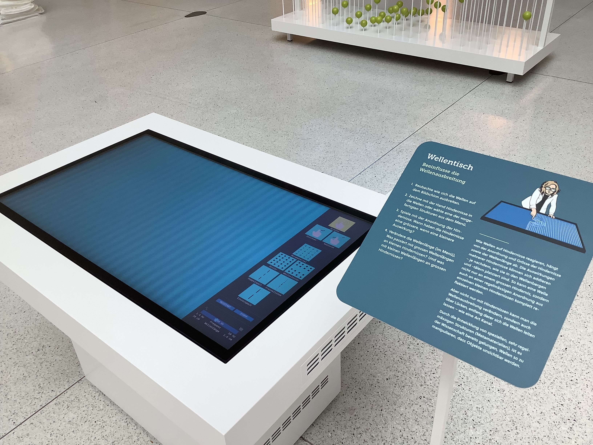
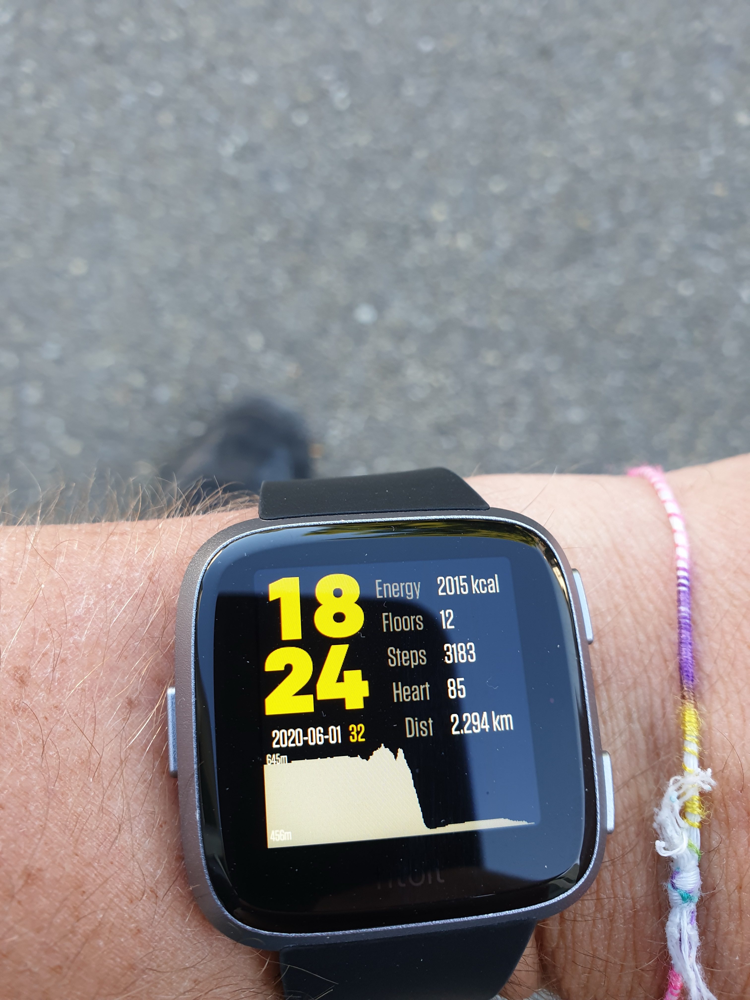

# List of Projects
The following is a list of projects that I have worked on, along with brief descriptions and involved technologies. 

Due to various restrictions, source access is only provided for selected projects. I might be able to supply access to other projects on demand.

[TOC]

# Wave simulator
**Involved Technologies**: C++, OpenGL, GLSL, SDL2, DearImGui

**Link**: [gitlab](https://gitlab.phys.ethz.ch/engelerp/framebuffer-testing)

**Description**:\
Wave simulator controlled via a 4K multitouch display in real-time.

Plane waves are propagating over the screen, and users can either scatter the waves off their fingers, place preprogrammed obstruction patterns, or draw their own obstructions directly onto the screen. 

The finite difference simulation is performed in real time on an RTX 3080, and in operation the system performs well over 10^10 single site updates per second. 

This system is an exhibit part of the "Wellen - Tauch ein!" exhibition from FocusTerra, which has since also been shown in the Seemuseum Kreuzlingen, and is currently in the HNF Paderborn. 

More in-depth information can be found in the linked gitlab's README.md, and an impression of the final device is shown below.

# Simulation framework for system of thousands of coupled resonators
**Involved Technologies**: C++, LAPACK, python, Make

**Link**: [gitlab](https://gitlab.phys.ethz.ch/engelerp/rbcomb-simulation)

**Description**:\
This is a simulation framework made to simulate the system I developed during my PhD, namely a system of 2000 coupled nonlinear resonators.

As several different approaches can be taken to represent the system (more theoretical assuming specific couplings, or more physical working with voltages), a lot of flexibility is provided in the definition of forces and the like.

For timestepping, an RK4 implementation is provided, but custom steppers can be plugged in instead.

# Autonomous temperature stabilization system
**Involved Technologies**: C++, python, mixed-signal PCB design, electronics, PID

**Link**: [gitlab](https://gitlab.phys.ethz.ch/engelerp/rbcomb-temperature-control)

**Description**:\
This system is controlled by an Atmel SAM3X8E ARM Cortex-M3 as broken out on the Arduino Due. 
The MCU receives temperature measurements (from an AD7124-4 AFE connected to NTC thermistors) and has the ability to control heating power (via an LTC6992 that PWMs into a buck mode step down voltage converter's MOSFET via a totem pole). 
All involved PCBs (apart from the Arduino) are custom designed.
Heaters are made from single side aluminium PCBs with a winding track routing throughout.
The MCU's configuration can be changed, and temperature readings extracted, via a python interface.

This setup allows the MCU to run a PID loop to stabilize the temperature. 
The achieved stability measured in the system is 10 mK. 

To avoid runaway conditions, there are independently controlled relays and smart switches placed in the current path, and the system's temperatures are continuously monitored. 
When monitoring stops, the system shuts down automatically.

More information about this system and photo impressions can be found [in my PhD thesis](https://doi.org/10.3929/ethz-b-000678922), in chapter 4.7.3. 

# FPGA lock-in amplifier
**Involved Technologies**: VHDL, signal analysis

**Link**: [gitlab](https://gitlab.phys.ethz.ch/engelerp/stitch)

**Description**:\
This project is work in progress. 

It aims to implement FPGA gateware that can:

- generate excitation signals at frequencies up to 500 kHz
- receive distance measurements from an attocube IDS3010 interferometric distance measuring system via LVDS-HSSL
- perform lock-in extraction of the relevant components from the measurements in real time

In one shot, up to 1023 programmable frequencies can be measured, and the excitation signal is ramped adiabatically between the different frequencies. 
The extracted cos/sin components for each of the requested frequencies is stored in BRAM and can be streamed back to the controlling PC.

Ringup times, dwell times and ramp speeds are individually programmable.

This device will be used to measure delicate topology in an elastic sample (designed using the Structure Search project, and microfabricated by me).

# High performance interference ray tracer
**Involved Technologies**: C++, OpenMP, python

**Link**: [gitlab](https://gitlab.phys.ethz.ch/engelerp/rbcomb-ray-tracer)

**Description**:\
The goal of this project was writing a program that can predict interference patterns seen in a microscope, for certain configurations of deformed overlapping thin films. 
The motivation of this project was sparked by a lack of understanding of observed results in the cleanroom. 

The ray tracer is parallelized using OpenMP and was run on a cluster (Piz Daint). 
As opposed to conventional ray tracers, here rays of several different colours are traced through materials with nontrivial curvatures and refractive indices. 
The meshes used to describe various surfaces present in the scene were generated leveraging the mesher infrastructure I developed for the Structure Search project. 

The obtained results were able to reproduce observations, and guided us in the right direction for the resolution of the encountered issues.

# RBComb control system
**Involved Technologies**: VHDL, python

**Link** (partial): [gitlab](https://gitlab.phys.ethz.ch/engelerp/bridge_fpga_ram)

**Description**:\
The control system of the RBComb experiment consists of a star network of 11 FPGAs. 
The hub receives commands from a PC via UART, and programs the other 10 FPGAs correspondingly. 
It also receives measurement data from an attocube IDS 3010, stores relevant data in LPDDR SDRAM and streams it back to the PC when requested.
Each of the other 10 FPGAs generates analog voltages on 576 independent channels, by controlling 72 DACs. 
In total, the voltages on more than 5000 analog nets are controlled.
These voltages are generated according to independently programmable sequences, parallelly in well synchronized manner.

The linked repo only shows the gateware flashed on the hub FPGA.

More information about the gateware can be found [in my PhD thesis](https://doi.org/10.3929/ethz-b-000678922), in the Setup chapter 4, especially 4.5 and 4.6. 
The python API to communicate with the system is described in chapter 4.4.

# PCB generation framework
**Involved Technologies**: python

**Link**: [gitlab](https://gitlab.phys.ethz.ch/code/experiment/rbcomb-breakout)

**Description**:\
Contains classes to represent Kicad pcbs, along with scripts that use these classes to generate different versions of Breakoutboards to break out the 5000 analog nets of the RBComb sample. 

# RBComb sample visualizer
**Involved Technologies**: C++, OpenGL, GLSL, python

**Link**: [gitlab](https://gitlab.phys.ethz.ch/engelerp/rbcomb-sample-visualizer)

**Description**:\
This program is utility software, used to keep a handle on complex RBComb samples. 
It can be used to perform some bookkeeping over microfabricated samples, in a visual manner. 
It also shows various pieces of information about selected objects of interest. 

This program is very useful:
Each of these samples contains over 2000 resonators and 5000 electrodes. 
The status of each of these objects should be recorded and tracked, per sample. 
Furthermore, relating specific electrodes to their representations within the controlling FPGA network facilitates quick experimentation.

The meshes used for rendering were generated in python using the earcut algorithm.

An impression of the program is shown in the movie below.

# Interactive MEMS resonator design optimizer
**Involved Technologies**: C++, OpenGL, GLSL

**Link**: [gitlab](https://gitlab.phys.ethz.ch/engelerp/arm-designer)

**Description**:\
This tool is used to efficiently adjust MEMS resonator designs, and output them either to AutoCAD for mask generation or SpaceClaim for simulation. 
The program is geared towards the type of resonator I developed in my PhD thesis, and enabled fast feedback loops when optimizing designs.

An impression of the program is shown below. 

# Interactive WLI data analyzer and visualizer
**Involved Technologies**: C++, OpenGL, GLSL

**Link**: [gitlab](https://gitlab.phys.ethz.ch/engelerp/nt1100-analyser)

**Description**:\
This program is used to load datasets generated by the Wycko NT1100 white light interferometer, visualize, analyze and compare them. 

An impression of its usage is shown below.

# Labbook generator
**Involved Technologies**: python, latex, bash, atom grammar, git, CI/CD pipeline

**Description**:\
In this project, I created a simple custom language that contains the necessary commands to write a labbook (titles, paragraphs, inserting images, inserting corrections, etc.). 
I also created a corresponding Atom grammar to get syntax highlighting, and added some utility macros. 

When a labbook is pushed to this repo, a CI/CD pipeline executes on a raspberry pi I installed as gitlab runner, which parses the labbook code, translates it to latex, and compiles that to a pdf. 

The repo contains sensitive information and is therefore not fit for sharing. 
Upon request I may prepare a clean version.

# Git diff
**Involved Technologies**: bash, git

**Link**: [gitlab](https://gitlab.phys.ethz.ch/engelerp/gitdiff)

**Description**:\
A script to generate a compiled latexdiff file from different git commits.

Very useful when collaborating on latex documents.

# FPGA defined FM transmitter
**Involved Technologies**: VHDL, C, embedded systems, telecommunications

**Description**:\
A system that takes analog audio as input via a phone connector, digitizes the input via an ADC, modulates it onto a carrier and outputs the resulting FM signal on a pin. Even without connecting an antenna to the output, the audio signal can be received with a nearby FM capable radio. The heart of the system is a MAX10 FPGA.

I built this project in the contex of a digital electronics lecture at ETH.

# Spartan Sound
**Involved Technologies**: VHDL, python, electronics

**Link**:  [gitlab](https://gitlab.phys.ethz.ch/engelerp/spartansound)

**Description**:\
An FPGA (Spartan 6) defined soundcard. 
It receives wave packets via serial, and drives a speaker via a pin by outputting the corresponding voltage through delta-sigma modulation. 
Continuous playback functionality is enabled by double buffering, one buffer is being played back while new data is being streamed into the other. 

The purpose of this project was mainly knowledge discovery pertaining programming the Spartan 6, using BRAM, communicating via serial, and performing delta-sigma modulation on an FPGA.

A video of the device in operation is shown below.

# Fitbit watchface
**Involved Technologies**: JavaScript, stylesheets

**Description**:\
I programmed a watch face for a Fitbit smartwatch. 
While the face displays all the typical data, it also draws a height trace, which shows how the user's height over sea level changed during the past few hours.
This functionality was inspired by a Garmin smartwatch.

Unfortunately the code was lost when Fitbit Studio was shut down, but an impression of the watchface in operation is shown below.

# Blackjack multiplayer game
**Involved Technologies**: C++, CMake, wxWidgets, requirements engineering

**Description**:\
A multiplayer blackjack game. 

Contains code for both, server and client. The repository contains design specification, requirements specification, and unit tests. 
This project was built as final project for a software engineering lecture at ETH.

# Home automation 
**Involved Technologies**: Javascript/HTML/CSS (frontent), python (backend)

**Description**:\
I have installed various smart switches and power meters in my home. 
These devices are connected to the network, and controlled via a webinterface hosted on a raspberry pi. 
A telegram bot functions as secondary interface.

# DLSC Projects
**Involved Technologies**: python, Keras, pyTorch

**Link**: [gitlab](https://gitlab.phys.ethz.ch/engelerp/dlsc-tasks)

**Description**:\
In the context of the Deep Learning in Scientific Computing lecture at ETH, I performed several projects. 
They involved noisy function approximation, time series forecasting, high-dimensional learning, design optimization, PINNs. 

# Automatic lab monitoring
**Involved Technologies**: python, InfluxDB, grafana

**Description**:\
I have set up automatic data logging and monitoring for the cmt-mm laboratory. 
This involves periodically connecting to various devices, reading their sensor values, and writing them into an InfluxDB database. 
This data is then visualized in a grafana dashboard. 

Critical data states also trigger warning messages in a dedicated Element channel, and effect automatic shutdowns when deemed necessary.

# Experimental data storage in database

# Foodweb simulations [gitlab](https://gitlab.phys.ethz.ch/engelerp/Foodwebs)

# Framework for automatic topological structure design
**Involved Technologies**: python, finite elements, CMA-ES

**Description**:\
This project constitutes a design suite that has the ability to automatically design topological materials. 
It is a collaboration of various members from the cmt-mm group. 
My contribution was developing a custom symmetry preserving mesher, developing the initial functional prototype, and consulting on questions pertaining software design decisions, version control, and optimization.

As this project is yet to be published, code can not be shared. 
More information can be found [in my PhD thesis](https://doi.org/10.3929/ethz-b-000678922), chapter 6.

# Dynamic friction simulation

# Texas Hold'em probability analysis
**Involved Technologies**: C++, OpenMP

**Description**:\
CLI program that outputs in real time various statistics about an ongoing game of texas hold'em poker. 
Most importantly, it shows the user's current winning probability and the strongest possible pocket cards, as determined from the currently available information. 

# Gameboy emulator
**Involved Technologies**: C++

**Description**:\
This project is work in progress. 

I have started work on a Nintendo Gameboy emulator, to learn how such systems can be built. 
Currently, it can perform a boot sequence, and execute code read from a cartridge. 
There is no video or audio output capability as of now.

# Switchboard )

# Project to automate and optimize study planning for sports research 
**Involved Technologies**: C++, VBA

**Description**:\
In this project I helped a research group optimize their study planning. 
As the subjects of this research are professional athletes, optimizing the necessary time is crucial. 
I helped create a program that automatically generates study schedules for various input parameters and restrictions, and lowers time requirements significantly compared to manually created time tables.

# Project to automate address retrieval from web resources 
**Involved Technologies**: python

**Description**:\
I automated the retrieval of addresses from web resources, which are necessary database contents current. 
Usage of my tool cut the database maintenance time by over 99 %.