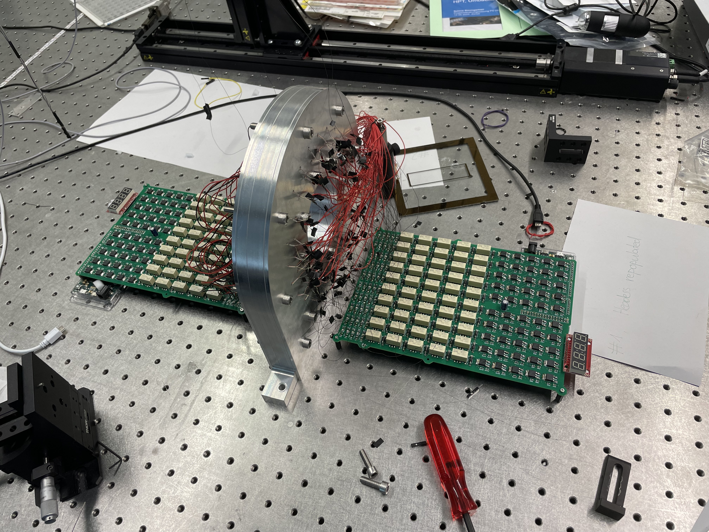
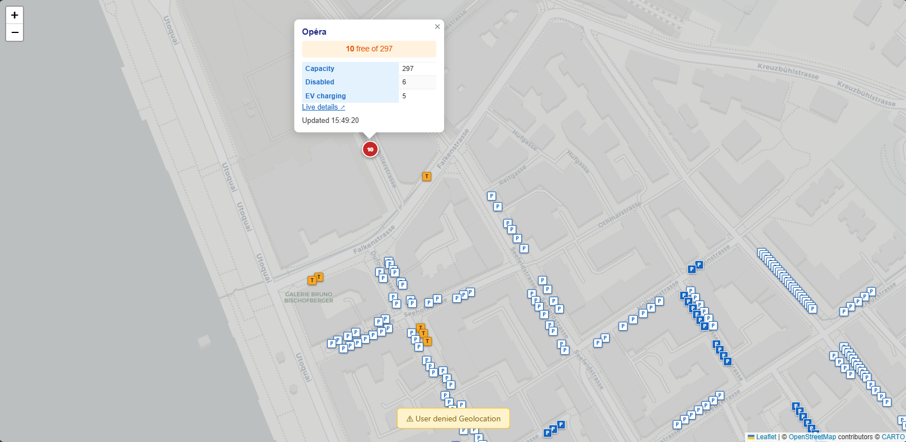
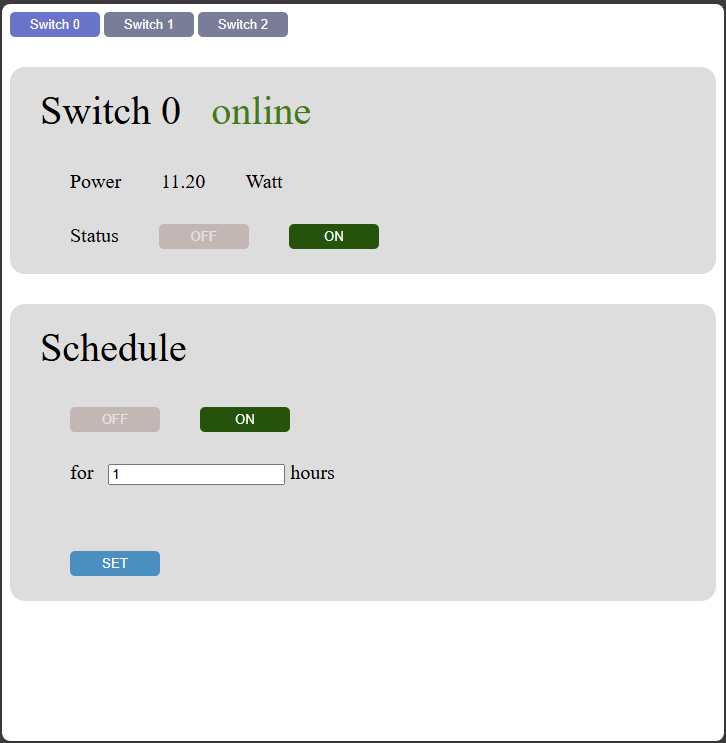

# List of Projects
The following is a list of projects that I have worked on, along with brief descriptions and involved technologies. 
The projects are grouped into the following categories: High performance, Hardware / Gateware / Embedded, Utility, and Other. 
But it should be noted that most projects belong to several of these groups.

Due to various restrictions, source access is only provided for selected projects. I might be able to supply access to other projects on demand.

[TOC]
# High Performance

## Wave simulator
**Involved Technologies**: C++, OpenGL, GLSL, SDL2, DearImGui

**Link**: [gitlab](https://gitlab.phys.ethz.ch/engelerp/framebuffer-testing)

**Description**:\
Wave simulator controlled via a 4K multitouch display in real-time.

Plane waves are propagating over the screen, and users can either scatter the waves off their fingers, place preprogrammed obstruction patterns, or draw their own obstructions directly onto the screen. 
Up to 12 concurrent touches can be handled.

The finite difference simulation is performed in real time on an RTX 3080, and in operation the system performs well over 10^10 single site updates per second. 

This system is part of FocusTerra's touring "Wellen - Tauch ein!" exhibition, which has been shown at Seemuseum Kreuzlingen and HNF Paderborn, and is currently (since 2025) at the Carl Bosch Museum Heidelberg. 

More in-depth information can be found in the linked gitlab's README.md, and an impression of the final device is shown below.

## Simulation framework for system of thousands of coupled resonators
**Involved Technologies**: C++, LAPACK, Python, Make

**Link**: [gitlab](https://gitlab.phys.ethz.ch/engelerp/rbcomb-simulation)

**Description**:\
This is a simulation framework made to simulate the system I developed during my PhD, namely a system of 2000 coupled nonlinear resonators.

As several different approaches can be taken to represent the system (more theoretical assuming specific couplings, or more physical working with voltages), a lot of flexibility is provided in the definition of forces and the like.

For timestepping, an RK4 implementation is provided, but custom steppers can be plugged in instead.

## High performance interference ray tracer
**Involved Technologies**: C++, OpenMP, Python

**Link**: [gitlab](https://gitlab.phys.ethz.ch/engelerp/rbcomb-ray-tracer)

**Description**:\
The goal of this project was writing a program that can predict interference patterns seen when observing a microfabricated sample under a microscope. 
The motivation of this project was sparked by a lack of understanding of observed results in the cleanroom. 

The ray tracer is parallelized using OpenMP and was run on a cluster (Piz Daint). 
As opposed to conventional ray tracers, here rays of several different colours are traced through materials with nontrivial curvatures and refractive indices. 
The meshes used to describe various surfaces present in the scene were generated leveraging the mesher infrastructure I developed for the Structure Search project. 

The obtained results were able to reproduce observations, and guided us in the right direction for the resolution of the encountered issues.

## Structure Search: Automatic topological structure design
**Involved Technologies**: Python, finite elements, CMA-ES

**Description**:\
This project constitutes a design suite that has the ability to automatically design topological materials. 
It is a collaboration of various members from the cmt-mm group. 
My contribution was developing a custom symmetry preserving mesher, developing the initial functional prototype, and leading the project on software design, version control, and optimization. 
In operation, the code is run on supercomputers.

More information can be found [in my PhD thesis](https://doi.org/10.3929/ethz-b-000678922), chapter 6.

## Texas Hold'em probability analysis
**Involved Technologies**: C++, OpenMP

**Description**:\
CLI program that outputs in real time various statistics about an ongoing game of texas hold'em poker. 
Most importantly, it shows the user's current winning probability and the strongest possible pocket cards, as determined from the currently available information. 

## Foodweb simulations
**Involved Technologies**: C++

**Description**\
Collection of foodweb simulations. This involved numerically solving equations on arbitrary graphs, and investigating when chaotic behaviour becomes stable via bifurcations. 
The goal was writing a code that could reproduce results reported in a paper, which was achieved.

This project was carried out in the framework of a semester thesis under supervision of Mauro Iazzi and Matthias Troyer.

# Hardware / Gateware / Embedded

## TIQI Signal Pre-conditioning PCB & Zynq-7000 XADC
**Involved Technologies**: PCB design, mixed-signal electronics, embedded C++, Zynq-7000, Xilinx Vivado

**Description**:\
Carried out in summer 2017 as a Scientific Assistant in the Trapped Ion Quantum Information Group (ETH D-PHYS), supervised by Vlad Negnevitsky.
The goal was to enable real-time laser intensity monitoring for trapped ion qubit control, using the XADC available on the Zedboard's Zynq-7000 SoC.

**Signal pre-conditioning PCB:**\
Designed, prototyped (on breadboard through multiple design-test iterations) and manufactured a custom 4-layer mixed-signal PCB that conditions up to 4 photodiode channels for the XADC:
- **Input stage**: 4× THS4521 fully differential amplifiers (145 MHz BW, 490 V/µs slew rate) — each channel is buffered, amplified to the XADC input range (0–1 V), low-pass filtered (1 MHz anti-aliasing cutoff), and can optionally level-shift the signal into the allowed range
- **Multiplexer**: ADG709 dual 4-to-1 analog multiplexer (55 MHz BW, low on-resistance) — channel selection controlled via Zedboard XADC header GPIO
- **Output stage**: Second THS4521 stage reduces common-mode voltage to XADC-compliant levels
- 4-layer stackup with dedicated ground and power planes; all components decoupled with multi-value bypass capacitors; power drawn from the 5 V XADC header rail; board-to-board connection via ribbon cable to Zedboard XADC header

**Zynq-7000 XADC knowledge discovery:**\
Characterized the XADC in detail (noise, drift, sampling speed, conversion accuracy) and documented all relevant operating modes:
- Sequential, continuous, event-driven, and external multiplexer modes
- Embedded C++ programming using the Xilinx XADC (XAdcPs) and GIC (XScuGic) drivers
- PL→PS interrupt system: full GIC setup, interrupt handler registration, and data collection via interrupt-driven event mode

This project produced an internal technical report and left the lab with a working PCB and a comprehensive reference document for future XADC users.

## Autonomous temperature stabilization system
**Involved Technologies**: C++, Python, mixed-signal PCB design, electronics, PID

**Link**: [gitlab](https://gitlab.phys.ethz.ch/engelerp/rbcomb-temperature-control)

**Description**:\
This system is controlled by an Atmel SAM3X8E ARM Cortex-M3 as broken out on the Arduino Due. 
The MCU receives temperature measurements (from an AD7124-4 AFE connected to NTC thermistors) and has the ability to control heating power (via an LTC6992 that PWMs into a buck mode step down voltage converter's MOSFET via a totem pole). 
All involved PCBs (apart from the Arduino) are custom designed.
Heaters are made from single side aluminium PCBs with a winding track routing throughout.
The MCU's configuration can be changed, and temperature readings extracted, via a Python interface.

This setup allows the MCU to run a PID loop to stabilize the temperature. 
The achieved stability measured in the system is 10 mK. 

To avoid runaway conditions, there are independently controlled relays and smart switches placed in the current path, and the system's temperatures are continuously monitored. 
When monitoring stops, the system shuts down automatically.

More information about this system and photo impressions can be found [in my PhD thesis](https://doi.org/10.3929/ethz-b-000678922), in chapter 4.7.3. 

An impression of some components of the system is shown below. 

## FPGA lock-in amplifier STITCH
**Involved Technologies**: VHDL, signal analysis

**Link**: [gitlab](https://gitlab.phys.ethz.ch/engelerp/stitch)

**Description**:\
In this project I implemented FPGA gateware that can:

- generate excitation signals at frequencies up to 500 kHz
- receive distance measurements from an attocube IDS3010 interferometric distance measuring system via LVDS-HSSL
- perform lock-in extraction of the relevant components from the measurements in real time

In one shot, up to 1023 programmable frequencies can be measured, and the excitation signal is ramped adiabatically between the different frequencies. 
The extracted cos/sin components for each of the requested frequencies is stored in BRAM and can be streamed back to the controlling PC.

Ringup times, dwell times and ramp speeds are individually programmable via an API. The gateware is deployed on a Numato Saturn (Spartan 6) device.

This device was successfully used to measure delicate topology in an elastic sample (designed using the Structure Search project, and microfabricated by me).
It is still in operation in the lab and has reliably delivered correct data since its inception.

## RBComb control system
**Involved Technologies**: VHDL, Python

**Link** (partial): [gitlab](https://gitlab.phys.ethz.ch/engelerp/bridge_fpga_ram)

**Description**:\
The control system of the RBComb experiment consists of a star network of 11 FPGAs. 
The hub receives commands from a PC via UART, and programs the other 10 FPGAs correspondingly. 
It also receives measurement data from an attocube IDS 3010, stores relevant data in LPDDR SDRAM and streams it back to the PC when requested.
Each of the other 10 FPGAs generates analog voltages on 576 independent channels, by controlling 72 DACs. 
In total, the voltages on more than 5000 analog nets are controlled.
These voltages are generated according to independently programmable sequences, parallelly in well synchronized manner.

The linked repo only shows the gateware flashed on the hub FPGA.

More information about the gateware can be found [in my PhD thesis](https://doi.org/10.3929/ethz-b-000678922), in the Setup chapter 4, especially 4.5 and 4.6. 
The Python API to communicate with the system is described in chapter 4.4.

## REVLOC — Real-time Engine Vehicle Logger & Onboard Companion
**Involved Technologies**: PCB design (KiCad), ESP32, embedded systems, power electronics

**Description**:
REVLOC is a compact, custom-designed 4-layer PCB that logs and streams vehicle telemetry in real time.
The board integrates an ESP32-WROOM-32E-N8 as the main microcontroller (Wi-Fi & Bluetooth), a Quectel L96-M33 GNSS module for positioning (with integrated or external antenna), an ICM-42688-P 6-DOF IMU (accelerometer + gyroscope), a QMC5883P 3-axis magnetometer for heading, and a BME280 barometric pressure sensor for altitude tracking.
Sensor data is logged to a microSD card and can be streamed wirelessly to connected clients.

Power is delivered via USB Type-C (with TVS ESD protection) through a custom dual-rail supply: a SY8089A1AAC synchronous buck converter for the main 3.3V rail, and an AP2112K LDO for clean analog power.
A CR1220 coin cell provides GNSS backup power to preserve almanac and ephemeris data across resets, significantly reducing time-to-first-fix.

The board includes 10 status LEDs (power, GNSS lock, stationary, client connected, UART activity, error, programming), two pushbuttons (reset and boot), and a 6-pin UART header for firmware programming via an FTDI cable.
All custom footprints and symbols were created from scratch for JLCPCB assembly.

## FPGA defined FM transmitter
**Involved Technologies**: VHDL

**Description**:\
A system that takes analog audio as input via a phone connector, digitizes the input via an ADC, modulates it onto a carrier and outputs the resulting FM signal on a pin. Even without connecting an antenna to the output, the audio signal can be received with a nearby FM capable radio. The heart of the system is a MAX10 FPGA.

I built this project in the contex of a digital electronics lecture at ETH.

## Blueberry Pi
**Involved Technologies**: Unix, Python, Raspberry Pi

**Description**:\
A Blueberry Pi setup can be deployed on a Raspberry Pi, and then facilitates UART via ethernet. The Blueberry Pi receives payload via TCP, and forwards it to the target device via serial port (and vice versa).

This is deployed in the lab to control UART-only devices via ethernet.

## Spartan Sound
**Involved Technologies**: VHDL, Python, electronics

**Link**:  [gitlab](https://gitlab.phys.ethz.ch/engelerp/spartansound)

**Description**:\
An FPGA (Spartan 6) defined soundcard. 
It receives wave packets via serial, and drives a speaker via a pin by outputting the corresponding voltage through delta-sigma modulation. 
Continuous playback functionality is enabled by double buffering, one buffer is being played back while new data is being streamed into the other. 

The purpose of this project was mainly knowledge discovery pertaining programming the Spartan 6, using BRAM, communicating via serial, and performing delta-sigma modulation on an FPGA.

A video of the device in operation is shown below.

## Switchboard
**Involved Technologies**: C++, Python, PCB design

**Links**: [PCB gitlab](https://gitlab.phys.ethz.ch/engelerp/owli), [Firmware gitlab](https://gitlab.phys.ethz.ch/engelerp/switchboard_firmware), [Driver gitlab](https://gitlab.phys.ethz.ch/engelerp/switchboard_driver)

**Description**:\
Multiplexer that selects from 50 analog channels, used for an acoustics experiment. 
Used via a Python interface, controlled by an arduino. 
An impression of the wired up system is shown below. 

# Utility

## Interactive WLI data analyzer and visualizer
**Involved Technologies**: C++, OpenGL, GLSL

**Link**: [gitlab](https://gitlab.phys.ethz.ch/engelerp/nt1100-analyser)

**Description**:\
This program is used to load datasets generated by the Wycko NT1100 white light interferometer, visualize, analyze and compare them. 

An impression of its usage is shown below.

## RBComb sample visualizer
**Involved Technologies**: C++, OpenGL, GLSL, Python

**Link**: [gitlab](https://gitlab.phys.ethz.ch/engelerp/rbcomb-sample-visualizer)

**Description**:\
This program is utility software, used to keep a handle on complex RBComb samples. 
It can be used to perform some bookkeeping over microfabricated samples, in a visual manner. 
It also shows various pieces of information about selected objects of interest. 

This program is very useful:
Each of these samples contains over 2000 resonators and 5000 electrodes. 
The status of each of these objects should be recorded and tracked, per sample. 
Furthermore, relating specific electrodes to their representations within the controlling FPGA network facilitates quick experimentation.

The meshes used for rendering were generated in Python using the earcut algorithm.

An impression of the program is shown in the movie below.

## Interactive MEMS resonator design optimizer
**Involved Technologies**: C++, OpenGL, GLSL

**Link**: [gitlab](https://gitlab.phys.ethz.ch/engelerp/arm-designer)

**Description**:\
This tool is used to efficiently adjust MEMS resonator designs, and output them either to AutoCAD for mask generation or SpaceClaim/Ansys for simulation. 
The program is geared towards the type of resonator I developed in my PhD thesis, and enabled fast feedback loops when optimizing designs.

An impression of the program is shown below. 

## Zurich Parking Map (woparky.com)
**Involved Technologies**: Go, Angular 21, TypeScript, Leaflet, leaflet.markercluster, RxJS, SCSS

**Link**: [woparky.com](https://www.woparky.com/)

**Description**:\
Real-time parking availability map for the City of Zurich. Shows ~46,000 street parking spaces and ~136 parking garages (Parkhäuser) with live occupancy data from the city's Parkleitsystem.

The Go backend (stdlib only, no framework) loads static city GeoJSON on startup, then polls the PLS Zürich RSS feed every 60 seconds, merging live free-space counts and status (open/closed) into an in-memory store protected by a sync.RWMutex. A single REST endpoint serves the merged dataset.

The Angular 21 frontend renders the map using Leaflet. ~46,000 street parking spaces are clustered via leaflet.markercluster (visible at zoom ≥ 16). The ~136 garages are shown as color-coded circle markers (green/orange/red/grey by availability ratio), updating every 60 s via RxJS polling. A proxy configuration forwards all `/api/*` calls to the Go backend during development.

Deployed on a Hetzner VPS. Data sources: Stadt Zürich Open Data (GeoJSON, CC-0), PLS Zürich RSS feed (CC-0).

## Home automation 
**Involved Technologies**: Javascript/HTML/CSS (frontend), Python (backend)

**Description**:\
I have installed various smart switches and power meters in my home. 
These devices are connected to the network, and controlled via a webinterface hosted on a raspberry pi. 
A telegram bot functions as secondary interface.

A screenshot of the interface is shown below.

## Automatic lab monitoring
**Involved Technologies**: Python, InfluxDB, grafana

**Description**:\
I have set up automatic data logging and monitoring for the cmt-mm laboratory. 
This involves periodically connecting to various devices, reading their sensor values, and writing them into an InfluxDB database. 
This data is then visualized in a grafana dashboard. 

Critical data states also trigger warning messages in a dedicated Element channel, and effect automatic shutdowns when deemed necessary.

## Git diff
**Involved Technologies**: bash, git

**Link**: [gitlab](https://gitlab.phys.ethz.ch/engelerp/gitdiff)

**Description**:\
A script to generate a compiled latexdiff file from different git commits.

Very useful when collaborating on latex documents.

## Labbook generator
**Involved Technologies**: Python, latex, bash, atom grammar, git, CI/CD pipeline

**Description**:\
In this project, I created a simple custom language that contains the necessary commands to write a labbook (titles, paragraphs, inserting images, inserting corrections, etc.). 
I also created a corresponding Atom grammar to get syntax highlighting, and added some utility macros. 

When a labbook is pushed to this repo, a CI/CD pipeline executes on a raspberry pi I installed as gitlab runner, which parses the labbook code, translates it to latex, and compiles that to a pdf. 

The repo contains sensitive information and is therefore not fit for sharing. 
Upon request I may prepare a clean version.

## PCB generation framework
**Involved Technologies**: Python

**Description**:\
Contains classes to represent Kicad pcbs, along with scripts that use these classes to generate different versions of Breakoutboards to break out the 5000 analog nets of the RBComb sample. 

## Project to automate and optimize study planning for sports research
**Involved Technologies**: C++, VBA

**Description**:\
In this project I helped a research group optimize their study planning. 
As the subjects of this research are professional athletes, optimizing the necessary time is crucial. 
I helped create a program that automatically generates study schedules for various input parameters and restrictions, and lowers time requirements significantly compared to manually created time tables.

## Project to automate address retrieval from web resources
**Involved Technologies**: Python

**Description**:\
I automated the retrieval of addresses from web resources, which are necessary to keep database contents current. 
Usage of my tool cut the database maintenance time by over 90 %.

# Other

## Fitbit watchface
**Involved Technologies**: JavaScript, CSS

**Description**:\
I programmed a watch face for a Fitbit smartwatch. 
While the face displays all the typical data, it also draws a height trace, which shows how the user's height over sea level changed during the past few hours.
This functionality was inspired by a Garmin smartwatch.

Unfortunately the code was lost when Fitbit Studio was shut down, but an impression of the watchface in operation is shown below.

## Blackjack multiplayer game
**Involved Technologies**: C++, CMake, wxWidgets, requirements engineering

**Link**: [gitlab](https://gitlab.phys.ethz.ch/engelerp/blackjack)

**Description**:\
A multiplayer blackjack game. 

Contains code for both, server and client. The repository contains design specification, requirements specification, and unit tests. 
This project was built as final project for a software engineering lecture at ETH.

## DLSC Projects
**Involved Technologies**: Python, Keras, pyTorch

**Description**:\
In the context of the Deep Learning in Scientific Computing lecture at ETH, I performed several projects. 
They involved noisy function approximation, time series forecasting, high-dimensional learning, design optimization, and PINNs. 

## Gameboy emulator
**Involved Technologies**: C++

**Description**:\
This project is work in progress. 

I have started work on a Nintendo Gameboy emulator, to learn how such systems can be built. 
Currently, it can perform a boot sequence, and execute code read from a cartridge. 
There is no video or audio output capability as of now.

